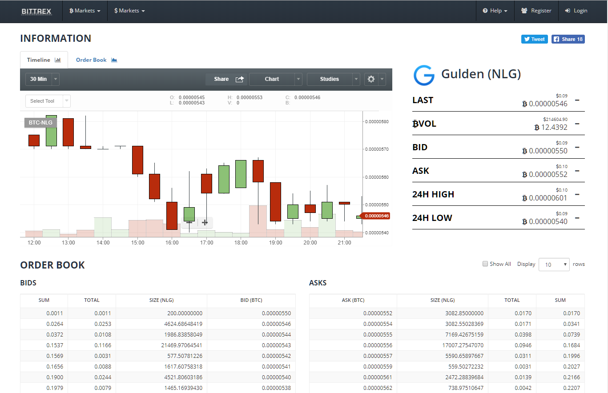

# Inleiding

Dit is een handleiding om Guldens te verwerven via een ander kanaal dan Gulden.com, Nocks of Litebit namelijk op de handelsbeurs Bittrex.
Deze handleiding is geschreven voor handelen via een desktop PC. Bittrex is webbased en slecht toegankelijk via een Smartphone. Voor iOS is er wel een app maar deze wordt hier niet
besproken.

Er wordt ook vanuit gegaan dat u een Gulden wallet heeft en de basisbeginselen van cryptocurrencies onder de knie heeft zoals het overmaken van Guldens.
Als u Guldens wilt kopen op Bittrex dient u over Bitcoins te beschikken. Als u die niet heeft moet u die eerst aanschaffen. Voor Nederlanders en Belgen is dat het gemakkelijkst via
https://bitonic.nl. 

Hier kunt u Bitcoins kopen via een iDEAL betaling (NL) of Bancontact (BE).

Ik ga ervan uit dat dat geen probleem vormt en dat u zo op eenvoudige wijze aan Bitcoins kunt komen (let op: wilt u voor meer dan 50 euro per week bij Bitonic kopen dan dient u daar eerst
uw rekeningnummer te verifiëren). Als dat wel een probleem is moet u deze handleiding terzijde leggen want dan is handelen op Bittrex voor u nog een brug te ver. Leer dan eerst
meer over crypto en Bitcoins.

Bittrex is een exchange waar in diverse cryptocurrencies gehandeld kan worden. We gaan hier in op het handelen in Gulden.

# Het begin

Om te handelen met Gulden gaat u naar https://www.bittrex.com/Market/?MarketName=BTC­NLG

U ziet dan het volgende scherm:

Prominent aanwezig is een candlestick diagram waarin het koersverloop zichtbaar is.U kunt nog meer informatie halen uit de grafiek maar dat komt later.

Naast de grafiek staat een tabel met koersinformatie. Alle koersinformatie wordt gegeven in Bitcoin waarde. Daarboven staat in een klein lettertype ook de waarde in US Dollar.

- “LAST” is de koers van de laatste transactie op Bittrex. Dit kan een koop maar ook een
verkooporder zijn.
- “BVOL” is de totale waarde van de Guldens die verhandeld zijn in de afgelopen 24 uur.
- “BID” is de hoogste prijs die momenteel geboden wordt en waarvoor iemand wil kopen.
- “ASK” is de laagste prijs waarvoor iemand momenteel wil verkopen.
- “24H HIGH” is de hoogste prijs van een transactie in de afgelopen 24 uur.
- “24H LOW” de laagste prijs van een transactie in de afgelopen 24 uur.

Daaronder is het ORDER BOOK te zien. Hier staan alle koop­ en verkooporders in die mensen voor Guldens geplaatst hebben. Links staan de orders van mensen die Guldens willen kopen tegen een bepaald bedrag en rechts staan de orders van mensen die Gulden willen verkopen tegen een bepaalde koers.

- “SUM” is het totale volume in Bitcoin van de orders tot aan de betreffende order.
- “TOTAL” is het volume in Bitcoin van die specifieke order.
- “SIZE (NLG)” is het aantal Guldens dat gekocht/verkocht wordt in die specifieke order.
- “BID (BTC)/ ASK (BTC)” is de prijs in Bitcoin die men wil betalen/ontvangen per
gekochte/verkochte Gulden.

Bovenaan in de grafiek zijn een aantal tabbladen zichtbaar met daaronder een keuzevak voor de tijdseenheid in de grafiek. De tijdseenheid staat standaard op 30 minuten.

Timeline is de getoonde grafiek met candlesticks. De hoogte van de candle zegt iets over de
spreiding van de koerswaarde in het genoemde tijdsbestek (en dus niet over de hoeveelheid
verhandelde Guldens). Door met de muiscursor op een candle te gaan staan kan exacte
informatie over de candle verkregen worden. Deze verschijnt net boven de grafiek: